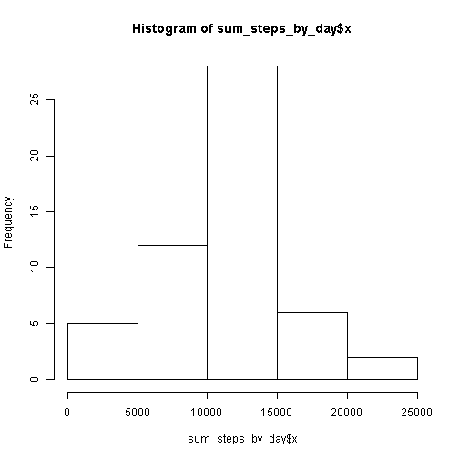

# Reproducible Research: Peer Assessment 1

```r
time <- format(Sys.time(),"%a %b %d %X %Y")
```
This document was last compiled on Sun Nov 16 17:57:28 2014.

## Loading and preprocessing the data
The dataset was download from [the course website][1] in the following way:

```r
temp <- tempfile()
download.file("http://d396qusza40orc.cloudfront.net/repdata%2Fdata%2Factivity.zip",temp)
df <- read.csv(unz(temp, "activity.csv"))
unlink(temp)
```

For analysis, we only consider complete cases (records for which we now the number of steps, the date and the interval), and filter ther data in the following way:


```r
data <- df[complete.cases(df),]
recsize <- nrow(data)
colsize <- ncol(data)
```
After the cleanup the record consists of 15264 records and 3 columns. Explanation of the columns from the exercise description:

1. steps: Number of steps taking in a 5-minute interval (missing values are coded as NA)
2. date: The date on which the measurement was taken in YYYY-MM-DD format
3. interval: Identifier for the 5-minute interval in which measurement was taken

A summary of the data is printed in the following:
<!-- html table generated in R 3.1.0 by xtable 1.7-4 package -->
<!-- Sun Nov 16 17:57:28 2014 -->
<table border=1>
<tr> <th>  </th> <th>     steps </th> <th>         date </th> <th>    interval </th>  </tr>
  <tr> <td align="right"> 1 </td> <td> Min.   :  0.0   </td> <td> 2012-10-02:  288   </td> <td> Min.   :   0   </td> </tr>
  <tr> <td align="right"> 2 </td> <td> 1st Qu.:  0.0   </td> <td> 2012-10-03:  288   </td> <td> 1st Qu.: 589   </td> </tr>
  <tr> <td align="right"> 3 </td> <td> Median :  0.0   </td> <td> 2012-10-04:  288   </td> <td> Median :1178   </td> </tr>
  <tr> <td align="right"> 4 </td> <td> Mean   : 37.4   </td> <td> 2012-10-05:  288   </td> <td> Mean   :1178   </td> </tr>
  <tr> <td align="right"> 5 </td> <td> 3rd Qu.: 12.0   </td> <td> 2012-10-06:  288   </td> <td> 3rd Qu.:1766   </td> </tr>
  <tr> <td align="right"> 6 </td> <td> Max.   :806.0   </td> <td> 2012-10-07:  288   </td> <td> Max.   :2355   </td> </tr>
  <tr> <td align="right"> 7 </td> <td>  </td> <td> (Other)   :13536   </td> <td>  </td> </tr>
   </table>

## What is mean total number of steps taken per day?

```r
options(scipen = 100, digits = 2)
sum_steps_by_day <- aggregate(data$steps, by=list(cat=data$date), FUN=sum)
mean_c<-mean(sum_steps_by_day$x)
median_c<-median(sum_steps_by_day$x)
print(hist(sum_steps_by_day$x))
```

 

```
## $breaks
## [1]     0  5000 10000 15000 20000 25000
## 
## $counts
## [1]  5 12 28  6  2
## 
## $density
## [1] 0.0000189 0.0000453 0.0001057 0.0000226 0.0000075
## 
## $mids
## [1]  2500  7500 12500 17500 22500
## 
## $xname
## [1] "sum_steps_by_day$x"
## 
## $equidist
## [1] TRUE
## 
## attr(,"class")
## [1] "histogram"
```
The mean of the sum of total steps taken each day is 10766.19 and the median is 10765.

## What is the average daily activity pattern?
1. Make a time series plot (i.e. type = "l") of the 5-minute interval (x-axis) and the average number of steps taken, averaged across all days (y-axis)
2. Which 5-minute interval, on average across all the days in the dataset, contains the maximum number of steps?

```r
d_by_inter <- aggregate(data$steps, by=list(cat=data$interval), FUN=mean)
plot(y=d_by_inter$x,x=d_by_inter$cat,type="l")
```

 

```r
d_max<-d_by_inter[d_by_inter$x==max(d_by_inter$x),]
max_fice<-max(d_max$cat)
```
The interval that contains the maxium number of steps is 835.

## Imputing missing values


```r
library(plyr)
options(scipen = 100, digits = 2)
impute.mean <- function(x) replace(x, is.na(x), mean(x, na.rm = TRUE))
rows_w_na<-nrow(df[!complete.cases(df),])
rows_all<-nrow(df)
df[, c("interval")] <- sapply(df[, c("interval")], as.factor)

df_imputed_na <- ddply(df, ~ interval, transform, steps = impute.mean(steps))
rows_w_na2<-nrow(df_imputed_na[!complete.cases(df_imputed_na),])
rows_all2<-nrow(df_imputed_na)

sum_steps_by_day <- aggregate(df_imputed_na$steps, by=list(cat=df_imputed_na$date), FUN=sum)
mean_c2<-mean(sum_steps_by_day$x)
median_c2<-median(sum_steps_by_day$x)
print(hist(sum_steps_by_day$x))
```

 

```
## $breaks
## [1]     0  5000 10000 15000 20000 25000
## 
## $counts
## [1]  5 12 36  6  2
## 
## $density
## [1] 0.0000164 0.0000393 0.0001180 0.0000197 0.0000066
## 
## $mids
## [1]  2500  7500 12500 17500 22500
## 
## $xname
## [1] "sum_steps_by_day$x"
## 
## $equidist
## [1] TRUE
## 
## attr(,"class")
## [1] "histogram"
```
The total number of rows with missing values is 2304 (out of 17568), after replacing missing values 0 (out of 17568).

The mean of the sum of total steps taken each day is 10766.19 and the median is 10766.19.

Since the NA's where replaced by the mean values of the respective groups, the means overall should not change. The median however slightly changes, as expected. The histogram looks fairly similar compared to the one prior to imputing the NA's (both quite "normal"), but all the bars are slightly higher then before (see different y scale.) The effect on the total number of steps is noticable though, especially for dates with a large number of missing values.

## Are there differences in activity patterns between weekdays and weekends?

```r
d<-df_imputed_na
d$date <- as.Date(d$date , "%Y-%m-%d")
d$weekday<-weekdays(d$date) %in% c("Saturday","Sunday")
#d[, c("weekday")] <- sapply(d[, c("weekday")], as.factor)
d_week<-d[!d$weekday,]
d_we<-d[d$weekday,]
d_by_week <- aggregate(d_week$steps, by=list(cat=d_week$interval), FUN=mean)
d_by_we <- aggregate(d_we$steps, by=list(cat=d_we$interval), FUN=mean)

par(mfrow=c(2,1)) 
plot(y=d_by_week$x,x=d_by_week$cat,type="l",main="Weekday")
plot(y=d_by_we$x,x=d_by_we$cat,type="l",main="Weekend")
```

 


[1]: https://d396qusza40orc.cloudfront.net/repdata%2Fdata%2Factivity.zip  "Dataset"
